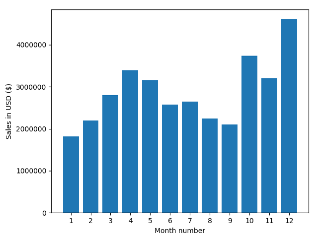

# DataScience-Sales-Analysis

Set of real world data science tasks completed using the Python Pandas library.

### What time should we display advertisements to maximize likelihood of customer's buying product?

### What was the best month for sales? How much was earned that month?

### What city sold the most product?
